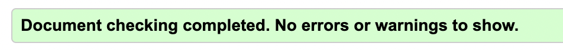
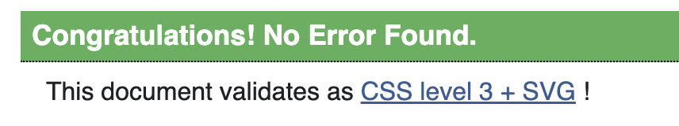
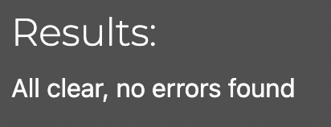

# Testing 

## Table of Contents:
1. [**Bugs**](#bugs)
    * [***Fixed Bugs***](#fixed-bugs)
    * [***Unfixed Bugs***](#unfixed-bugs)

### Manual testing
I manually tested this site in multiple ways highlighted below:
* I tested every feature and its responsiveness through an extension of a live server in VScode.
* I deployed the site in an early stage on Heroku to make sure everything was working as intended. 
* I received invaluable feedback from my mentor David, students in my community, family members and friends working in the industry.
* I tested the site for cross-compatibility in the two most used browsers, Chrome and Safari.
* I used DevTools to easily move between different screen sizes, simulating sizes between 370px to 4000px (but it is also functional on even larger screens given the max-width setting on the Body element to keep the content compact instead of stretched).

Expected -
Testing -
Result - 
Fix -

### User stories
User Story: As a site user, I can navigate the site content from the landing page so that I can access all the content easily and find what I'm looking for.

Expected:

The landing page should include a navigation bar with links to different pages.
Each section on the landing page should have buttons to access the corresponding pages.
Testing:

Visit the landing page.
Look for a navigation bar at the top of the page.
Check that the navigation bar contains links to all necessary pages (e.g., Home, Menu, Book, Register, Login).
Verify that each section on the landing page includes buttons or links to access the relevant pages.
Result:
The landing page includes a navigation bar with links and buttons to access all site content.

Fix:
N/A

User Story: As a site user, I can register an account so that I can make a table booking.

Expected:

There should be a page for users to register an account.
Users should be able to enter their details and have them authenticated.
Testing:

Navigate to the registration page.
Fill out the registration form with valid details.
Submit the form.
Check that the system registers the user and authenticates their details.
Result:
Users can successfully register accounts, and their details are authenticated.

Fix:
N/A

User Story: As a site user/admin, I can log in and log out of my account so that I can access the booking system.

Expected:

There should be a login page where users/admins can enter their credentials.
Upon successful authentication, users/admins should be directed to their account profile.
Users/admins should be able to log out from their accounts.
Testing:

Visit the login page.
Enter valid login credentials.
Submit the login form.
Verify that the system authenticates the user/admin.
Check that the user/admin is redirected to their account profile.
Log out from the account.
Verify that the user/admin is logged out and redirected to the login page.
Result:
Users/admins can successfully log in and out of their accounts, and authentication is functioning correctly.

Fix:
N/A

User Story: As an admin user, I can log in to an admin account so that I can confirm/cancel requests and see all current/previous bookings.

Expected:

There should be a separate admin login page with access to an admin panel.
Admins should be able to view all booking requests, confirmed bookings, and canceled bookings.
Admins should have the ability to filter bookings based on status and date.
Testing:

Visit the admin login page.
Enter valid admin login credentials.
Submit the login form.
Check that the admin is redirected to the admin panel/dashboard.
Navigate to the booking management section.
Verify that all booking requests, confirmed bookings, and canceled bookings are displayed.
Test the filtering functionality by filtering bookings based on status and date.
Result:
Admins can successfully log in to the admin account, access the admin panel, view bookings, and use the filtering functionality.

Fix:
N/A

User Story: As a site user, I can access my account so that I can edit my details or delete my account.

Expected:

There should be a profile dashboard accessible to logged-in users.
Users should be able to view their account details.
Users should have the option to edit their account details.
Users should have the option to delete their account.
Testing:

Log in to the user account.
Navigate to the profile/dashboard page.
Verify that the user's account details are displayed.
Test the edit functionality by modifying account details.
Verify that changes are saved successfully.
Test the delete account functionality.
Confirm that the user account is deleted.
Result:
Users can successfully access their account, view, edit, and delete account details.

Fix:
N/A

User Story: As a site user, I can send a booking request with all my details so that I can book a table with all the necessary details.

Expected:

There should be a booking request form accessible to logged-in users.
The booking request form should include fields for personal details, time, date, and guest options.
The form should be prepopulated with the user's account details.
There should be a section for special requests.
Testing:

Log in to the user account.
Navigate to the booking request form.
Verify that the form includes fields for personal details, time, date, and guest options.
Check that the form is prepopulated with the user's account details.
Test the special request section by adding a special request.
Submit the booking request form.
Result:
Users can successfully send a booking request with all necessary details, including personal information and special requests.

Fix:
N/A

User Story: As a site user, I can book a table based on the requirements so that I properly book a table and have a high chance of having it approved.

Expected:

The booking page should provide sufficient information on form requirements.
Users should receive an error message if they choose an incorrect date, time, or guest amount.
Users should receive an error message if they attempt to make an identical booking.
Testing:

Navigate to the booking page.
Verify that there is clear information about the form requirements.
Test the form by selecting an incorrect date, time, or guest amount.
Confirm that an error message is displayed.
Attempt to make a booking identical to an existing one.
Confirm that an error message is displayed.
Result:
Users can successfully book a table based on requirements and receive appropriate error messages for incorrect selections.

Fix:

User Story: As a site user, I can edit/cancel my booking requests so that I can customize my requests and have control over my bookings.

Expected:

Users should be able to view all their booking requests on their profile/dashboard.
Users should have the option to edit their booking requests.
Users should have the option to cancel their booking requests.
Testing:

Log in to the user account.
Navigate to the profile/dashboard page.
Verify that all booking requests are displayed.
Test the edit functionality by modifying a booking request.
Confirm that changes are saved successfully.
Test the cancel functionality by canceling a booking request.
Confirm that the booking request is successfully canceled.
Result:
Users can successfully edit and cancel their booking requests, providing them with control over their bookings.

Fix:
N/A

User Story: As an admin user, I can access each booking so that I can cancel/confirm the requests and see special requests/contact details for the user.

Expected:

Admin users should have access to every booking.
Admin users should be able to cancel or confirm booking requests.
Admin users should be able to view all customer details and booking request details for each booking.
Testing:

Log in to the admin account.
Navigate to the admin panel or booking management section.
Verify that all booking requests are listed.
Test the cancel functionality by canceling a booking request.
Confirm that the booking request is successfully canceled.
Test the confirm functionality by confirming a booking request.
Confirm that the booking request is successfully confirmed.
Select a booking request and verify that all customer details and booking request details are visible.
Result:
Admin users can successfully access, cancel, and confirm booking requests, and view all relevant details for each booking.

Fix:
Ensure that all booking details are properly displayed and actions such as canceling and confirming are functioning correctly.

User Story: As a site user, I can access the menu for the restaurant so that I can see what food they have.

Expected:

There should be a link to the menu from the landing page and navigation bar.
A page with all menu items and prices should be available.
Clear headings and descriptive names of each menu item should be provided.
Testing:

Navigate to the landing page.
Look for a link to the menu in the navigation bar.
Click on the menu link and verify that it directs to the menu page.
On the menu page, verify that all menu items and prices are displayed.
Check that each menu item has a clear heading and descriptive name.
Result:
Users can successfully access the restaurant menu and view all menu items with clear descriptions and prices.

Fix:
Ensure that the menu link is easily accessible and that all menu items are accurately listed with clear descriptions.

User Story: As a site user/admin, I can receive confirmations on my actions on the site so that I know the actions have been fulfilled.

Expected:

Users should receive confirmation when they send a booking request.
Users should receive confirmation when they edit or delete their account.
Users should receive confirmation when they edit or delete their booking requests.
Testing:

Send a booking request.
After sending the booking request, verify that a confirmation message is displayed.
Edit your account details.
After editing the account details, verify that a confirmation message is displayed.
Delete your account.
After deleting the account, verify that a confirmation message is displayed.
Edit one of your booking requests.
After editing the booking request, verify that a confirmation message is displayed.
Delete one of your booking requests.
After deleting the booking request, verify that a confirmation message is displayed.

Result:
Users/admins receive confirmation messages for various actions such as sending booking requests, editing/deleting accounts, and editing/deleting booking requests.

Fix:
Ensure that confirmation messages are displayed consistently and accurately for all relevant actions on the site.

### Validator Testing 

- HTML
  - There were no errors present when passing through the official W3C validator 

- CSS
  - There were no errors present when passing through the official Jigsaw validator with direct input 

- PEP8
  - There were no errors present when passing through the PEP8 CI Python linter 

### Lighthouse testing 

This testing was done in an incognito window in Chrome to make sure the results were not influenced by browser extensions.

In general Mobile scores were lower in performance for two main reasons, cdn imports from bootstrap, jquery, and the already compressed (multiple times hero images).

__Desktop version:__

#### Home front page 
__Mobile version:__

#### Quiz area

__Mobile version:__

### Wave accessibility evaluation

I also used the Wave evaluation tool to make sure I covered all my bases. 

The evaluation is free from errors and below is taken from the Home page and quiz page.

#### Wave home page

#### Wave quiz page

### Bugs

- 

#### Unfixed Bugs
- When too many bookings on profile, there is no space between white box and footer (but the actual content is still visible) but I decided not to fix that since staff would be clearing all bookings weekly from the system that are not necessary and we dont expect users to have that many bookings 